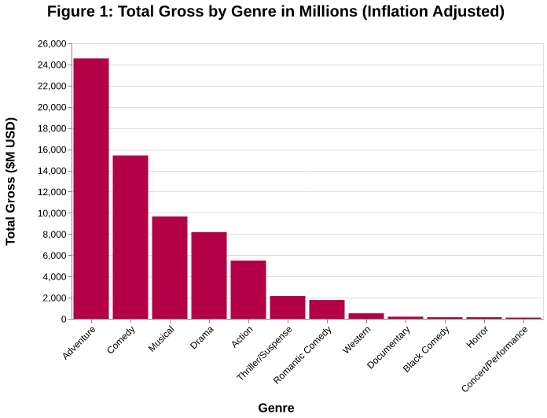
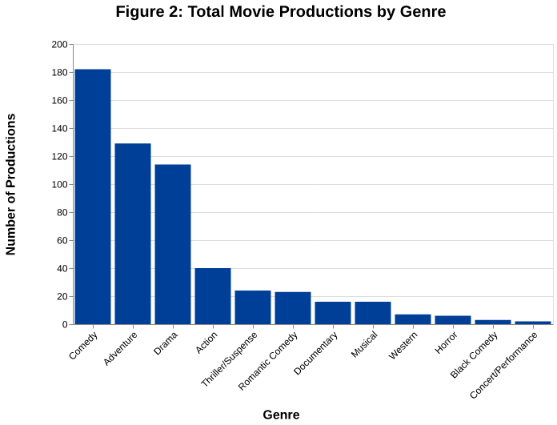

# Disney Box Office Analysis by Genre

Exploratory analysis of Walt Disney Studios box office data (1937-2016), examining which movie genre has generated the most income and whether that genre is also the one Disney produces most often.

## Key Findings
- **Adventure** is the highest-grossing genre by a wide margin: $24.6B in inflation-adjusted gross, well ahead of Comedy ($15.4B) and Musical ($9.7B).
- **Comedy**, not Adventure, is the most-produced genre (182 films vs. 129), despite grossing less overall. This did not match the initial hypothesis that the top-grossing and top-produced genres would be the same.
- The mismatch suggests Disney may prioritize the lower cost and higher output of comedy productions over per-film revenue, though production cost data isn't available in this dataset to confirm that directly.

## Results

| Genre | Total Gross ($M, inflation-adjusted) | Movies Produced |
|---|---|---|
| Adventure | 24,561.3 | 129 |
| Comedy | 15,409.5 | 182 |
| Musical | 9,657.6 | 16 |
| Drama | 8,195.8 | 114 |
| Action | 5,498.9 | 40 |
| Thriller/Suspense | 2,151.7 | 24 |
| Romantic Comedy | 1,788.9 | 23 |
| Western | 516.7 | 7 |
| Documentary | 203.5 | 16 |
| Black Comedy | 156.7 | 3 |
| Horror | 140.5 | 6 |
| Concert/Performance | 114.8 | 2 |




## Approach
1. **Cleaning:** loaded `disney_movies_total_gross.csv`, kept the `movie_title`, `genre`, and `inflation_adjusted_gross` columns, and used a small helper script (`func_script.py`) to strip currency formatting and convert gross figures to numeric millions.
2. **Grouping:** aggregated total gross and movie count by genre.
3. **Visualization:** built bar charts in Altair comparing genres on both total gross and production count.
4. **Discussion:** compared the results against the initial hypotheses and considered possible explanations for the mismatch.

## Limitations and Next Steps
- 17 of the 579 movies (about 3%) have no listed genre and are excluded from the grouped totals.
- Production cost isn't available in this dataset; adding it (e.g. via budget data from another source) would let this directly test the cost-driven explanation raised in the discussion.
- The dataset only covers Disney's own studio releases, not its other labels (Pixar, Marvel, Lucasfilm), so the results describe classic/live-action Disney specifically.

## Data
[Disney Character Success 2000-2016](https://data.world/kgarrett/disney-character-success-00-16), compiled by Kelly Garrett. `disney_movies_total_gross.csv` is included in this repo under `data/`.

## Running It
```
pip install -r requirements.txt
jupyter notebook disney-EDA.ipynb
```

## Tools
Python, pandas, NumPy, Altair

*Completed as part of the IBM Data Science Professional Certificate.*
