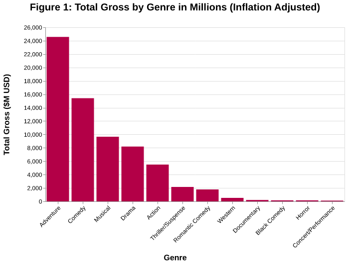
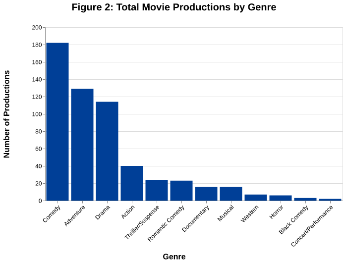
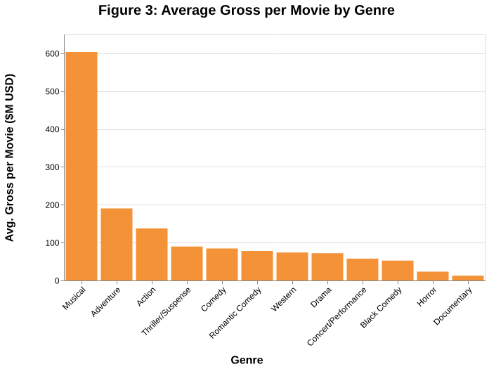
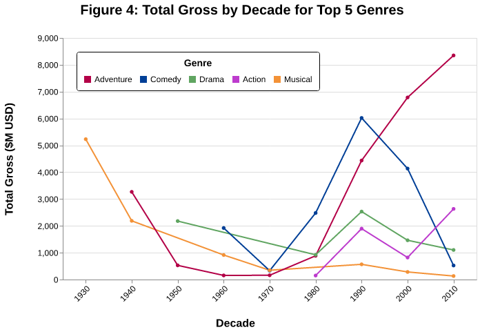
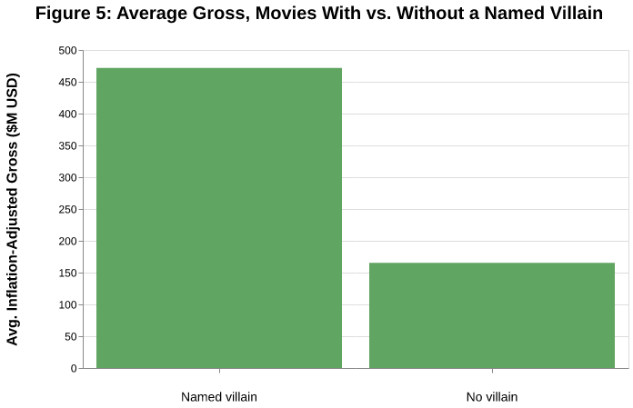

# Disney Box Office Analysis by Genre

Exploratory analysis of Walt Disney Studios box office data (1937-2016), examining which movie genre has generated the most income, whether that genre is also the one Disney produces most often, and how that picture changes when you control for production count, time period, and story elements.

## Key Findings
- **Adventure** is the highest-grossing genre by total: $24.6B in inflation-adjusted gross, vs. $15.4B for Comedy and $9.7B for Musical.
- **Comedy**, not Adventure, is the most-produced genre (182 films vs. 129), despite grossing less overall.
- **On a per-movie basis, Musical actually outperforms every other genre** ($603.6M average per film vs. $190.4M for Adventure), despite having produced only 16 films. Adventure's lead is a volume effect: more movies, not better movies on average.
- **Adventure's dominance is recent.** Musical led every decade from the 1930s through the 1960s; Adventure doesn't take a clear lead until the 2000s and 2010s, likely tied to Disney's franchise-driven strategy in that period.
- In a smaller, 47-film subset with character data, movies with a named villain averaged a higher gross ($471.7M) than movies without one ($165.4M), though the "no villain" group is only 5 films, so this is suggestive rather than conclusive.

## Results

### By Genre (all 562 movies with a listed genre)

| Genre | Total Gross ($M) | Movies Produced | Avg. Gross per Movie ($M) |
|---|---|---|---|
| Musical | 9,657.6 | 16 | **603.6** |
| Adventure | 24,561.3 | 129 | 190.4 |
| Action | 5,498.9 | 40 | 137.5 |
| Thriller/Suspense | 2,151.7 | 24 | 89.7 |
| Comedy | 15,409.5 | 182 | 84.7 |
| Romantic Comedy | 1,788.9 | 23 | 77.8 |
| Western | 516.7 | 7 | 73.8 |
| Drama | 8,195.8 | 114 | 71.9 |
| Concert/Performance | 114.8 | 2 | 57.4 |
| Black Comedy | 156.7 | 3 | 52.2 |
| Horror | 140.5 | 6 | 23.4 |
| Documentary | 203.5 | 16 | 12.7 |

*(sorted by average gross per movie)*







## Approach
1. **Cleaning:** loaded `disney_movies_total_gross.csv`, kept the `movie_title`, `genre`, `release_date`, and `inflation_adjusted_gross` columns, and used a small helper script (`func_script.py`) to strip currency formatting and convert gross figures to numeric millions.
2. **Grouping:** aggregated total gross and movie count by genre, then derived average gross per movie.
3. **Time analysis:** extracted release decade and tracked total gross by decade for the five highest-grossing genres.
4. **Character join:** merged in `disney-characters.csv` (a smaller, mostly classic-animated-film subset) to compare average gross for films with vs. without a named villain.
5. **Visualization:** built five Altair charts covering totals, per-movie averages, the decade trend, and the villain comparison.
6. **Discussion:** compared results against the initial hypotheses and considered explanations for the gap between total and per-movie performance.

## Limitations and Next Steps
- 17 of the 579 movies (about 3%) have no listed genre and are excluded from the grouped totals.
- Musical's high per-movie average is driven heavily by a handful of classic releases (led by *Snow White and the Seven Dwarfs*), so that average is sensitive to a few outliers rather than reflecting a consistently high-grossing genre.
- The character-data join only matches 47 of 579 movies, skewed toward older animated films, so the villain comparison isn't representative of the full catalog.
- Production cost data isn't available in this dataset; adding it (e.g. via budget figures from another source) would let this directly test whether lower-cost genres are produced more often, as the original discussion speculates.
- The dataset only covers Disney's own studio releases, not its other labels (Pixar, Marvel, Lucasfilm).

## Data
[Disney Character Success 2000-2016](https://data.world/kgarrett/disney-character-success-00-16), compiled by Kelly Garrett. Both `disney_movies_total_gross.csv` and `disney-characters.csv` are included in this repo under `data/`.

## Running It
```
pip install -r requirements.txt
jupyter notebook disney-EDA.ipynb
```

## Tools
Python, pandas, NumPy, Altair
